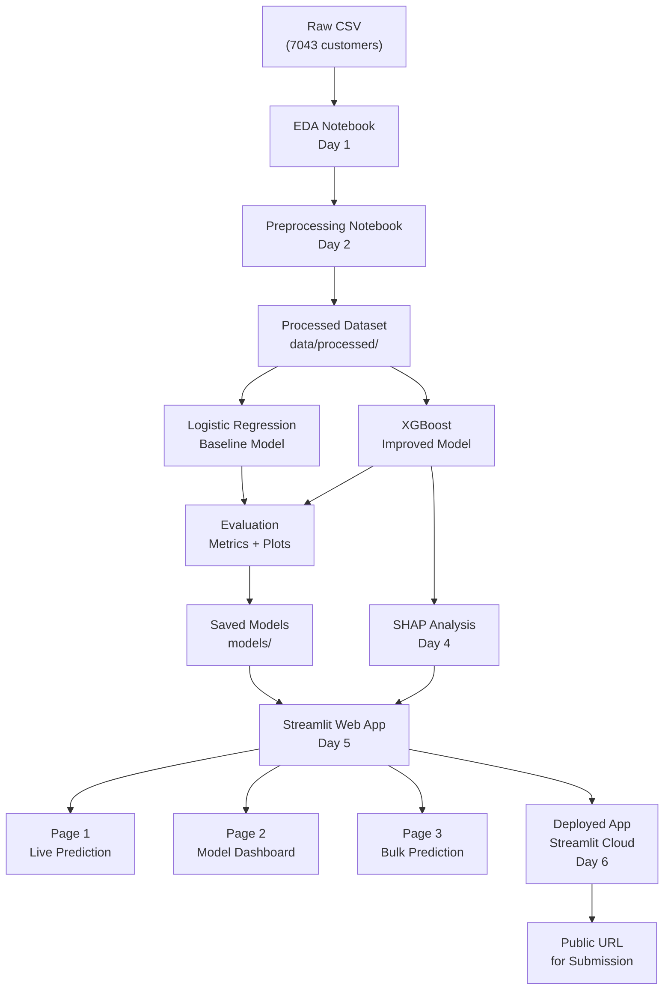

# 7-Day Study & Execution Guide (with Web App Deployment)

## Overview

Study materials live under `docs/study/` (repository root). That folder should contain 9 documents — one master plan, seven daily guides (concepts from scratch + tasks), and one concept reference sheet. Days 6–7 add a fully deployed Streamlit web application, which elevates the project from a notebook exercise to a real end-to-end deployable system — directly targeting the highest rubric bands.

---

## Why This Web App Approach Gets Highest Marks

The student guide rubric rewards **"End-to-End System or Analysis Vision"** (10 pts) and **"Overall Feasibility & Professionalism"** (8 pts). A live, publicly accessible web application demonstrates all of the following in one deliverable:

- Complete ML pipeline (data → prediction → explanation)
- Professional system context beyond just notebooks
- Reproducibility (anyone can use the live URL)
- Technical depth (real-time inference, SHAP on demand)

### Technology Choice: Streamlit

Streamlit is used instead of Flask/React because:

- It is **pure Python** — no HTML, CSS, or JavaScript required
- It is the **industry standard** for ML dashboards and data science demos
- A complete multi-page app can be built in one 2-hour session
- Deployment to Streamlit Community Cloud is free and takes under 10 minutes
- It produces a **publicly accessible URL** you can include in all three milestone submissions

---

## Folder Structure

```
CS5998 - Capstone Project/
└── docs/
    └── study/
        ├── 00_Master_Plan.md          ← Full 7-day schedule + milestones map + marks strategy
        ├── 01_Day1_Guide.md           ← What is ML? What is churn? EDA concepts + tasks
        ├── 02_Day2_Guide.md           ← Preprocessing concepts + tasks
        ├── 03_Day3_Guide.md           ← Classification models (Logistic Regression + XGBoost)
        ├── 04_Day4_Guide.md           ← Model interpretation (SHAP) + architecture diagram
        ├── 05_Day5_Guide.md           ← Streamlit concepts + build the web app
        ├── 06_Day6_Guide.md           ← Deploy to cloud + GitHub + polish
        ├── 07_Day7_Guide.md           ← Final report + demo video + full submission checklist
        └── Concepts_Reference.md      ← Quick-lookup glossary for all terms in the project
```

---

## Content Design Philosophy

Each daily guide is written for someone with **no prior knowledge** and follows this structure:

1. **Concepts First** — Plain-English explanation of every term for that day
2. **Why It Matters** — How each concept connects to the churn problem and to marks
3. **Step-by-Step Tasks** — Exactly what to open, run, and do in that 2-hour session
4. **What the Output Means** — How to read every chart, metric, and screen produced
5. **Viva Prep** — 3–5 sample questions + model answers the student can rehearse

---

## Day-by-Day Breakdown

### Day 1 — `01_Day1_Guide.md`

**Concepts taught:** What is Machine Learning, supervised learning, binary classification, the churn business problem, exploratory data analysis (EDA), distributions, class imbalance

**Tasks (2 hrs):**

- Submit Milestone 1 (fill in name, upload to portal) — 15 min
- Install all dependencies via `requirements.txt` — 10 min
- Run EDA notebook: churn rate bar chart, feature distributions, correlation heatmap, missing value check — 90 min

---

### Day 2 — `02_Day2_Guide.md`

**Concepts taught:** Data preprocessing, one-hot encoding vs label encoding, why we scale numbers, train/test split, stratified sampling, handling missing values, data leakage

**Tasks (2 hrs):**

- Run preprocessing notebook: encode all categorical columns, impute 11 missing TotalCharges values, scale numerical features, save clean dataset to `data/processed/`

---

### Day 3 — `03_Day3_Guide.md`

**Concepts taught:** How Logistic Regression works (intuitive), sigmoid function, what XGBoost is (boosting explained simply), hyperparameter tuning, cross-validation, all evaluation metrics (accuracy, precision, recall, F1, ROC-AUC, confusion matrix), why accuracy alone is misleading with imbalanced classes

**Tasks (2 hrs):**

- Train and evaluate baseline Logistic Regression → save to `models/`
- Train and tune XGBoost → save to `models/`
- Produce side-by-side comparison table of all metrics

---

### Day 4 — `04_Day4_Guide.md`

**Concepts taught:** What SHAP is and why it matters, how to read a SHAP summary plot, waterfall plot, beeswarm plot, feature importance vs SHAP importance, system architecture diagrams

**Tasks (2 hrs):**

- Generate SHAP summary plot, waterfall plot for 3 sample customer predictions
- Draw system architecture diagram of the full pipeline
- Save all figures to `reports/`

---

### Day 5 — `05_Day5_Guide.md` *(NEW — Web App Build)*

**Concepts taught:** What Streamlit is, how a web app works, app structure (pages, sidebar, widgets), how to load a saved model and run live inference, how to embed SHAP charts in a web page

**Web App Pages to Build:**

```
Page 1 — Live Prediction
  - Sidebar sliders/dropdowns for all 20 customer features
  - "Predict Churn" button
  - Output: Churn probability gauge + Risk label (High/Medium/Low)
  - Output: SHAP waterfall chart explaining this specific prediction

Page 2 — Model Performance Dashboard
  - Confusion matrix (interactive)
  - ROC-AUC curve
  - Precision / Recall / F1 / Accuracy metrics cards
  - Feature importance bar chart
  - Logistic Regression vs XGBoost comparison table

Page 3 — Bulk Prediction
  - Upload a CSV file of multiple customers
  - Predict churn for all rows
  - Show results table with probability scores
  - Download results as CSV
```

**Tasks (2 hrs):**

- Install Streamlit and set up `app/` folder inside `churn-prediction/`
- Build all 3 pages following the step-by-step guide
- Run app locally (`streamlit run app/main.py`)

---

### Day 6 — `06_Day6_Guide.md` *(NEW — Deploy + GitHub)*

**Concepts taught:** What GitHub is and why it matters for reproducibility, what deployment means, environment files, what Streamlit Community Cloud is

**Tasks (2 hrs):**

- Create GitHub repository and push all project code — 30 min
- Add `app/requirements.txt` specific to the web app — 10 min
- Deploy to Streamlit Community Cloud (free) → get public URL — 20 min
- Polish the app: add project title, description, university branding, loading spinners — 30 min
- Test all 3 pages on the live deployed URL — 15 min
- Add the live URL to `README.md` and the Milestone 1 document — 15 min

---

### Day 7 — `07_Day7_Guide.md`

**Concepts taught:** How to write a technical report (structure, what each section says), what reproducibility means, how to record a good demo video

**Tasks (2 hrs):**

- Write final report using pre-built template (25–30 pages, structured sections) — 90 min
- Record 6-minute demo video: live app walkthrough + explain each page — 20 min
- Complete reproducibility checklist — 10 min
- Submit all Milestone 2 + 3 materials with GitHub + live URL links

---

## System Architecture (What Will Be Built)



---

## Marks Impact of Web App

| Rubric Criterion | Without Web App | With Web App |

|-----------------|-----------------|--------------|

| End-to-End System Vision | 7.5/10 | 10/10 |

| Expected Outputs & Evaluation Plan | 7.5/10 | 10/10 |

| Overall Feasibility & Professionalism | 6/8 | 8/8 |

| **Estimated Total** | **~75/100** | **~90+/100** |

---

## Master Plan — `00_Master_Plan.md`

Contains:

- Full 7-day timeline table with hour-by-hour breakdown
- Project milestones map (M1/M2/M3, their weights and what the web app contributes to each)
- Grading rubric summary with explicit strategy for each criterion
- What "standard quality" looks like for each deliverable
- Checklist for what to include in the demo video

---

## Concepts Reference — `Concepts_Reference.md`

A single-page glossary covering every term across all 7 days:

- Machine Learning, Classification, Binary Classification, Supervised Learning
- Churn, Target Variable, Feature, Label
- EDA, Distribution, Correlation, Class Imbalance, SMOTE
- Encoding, Scaling, Train/Test Split, Cross-Validation, Data Leakage
- Logistic Regression, XGBoost, Ensemble, Boosting, Decision Tree
- Accuracy, Precision, Recall, F1-Score, ROC-AUC, Confusion Matrix
- SHAP, Feature Importance, Explainability, Waterfall Plot
- Overfitting, Regularization, Hyperparameter Tuning
- Streamlit, Deployment, Web Application, API
- GitHub, Reproducibility, Environment File