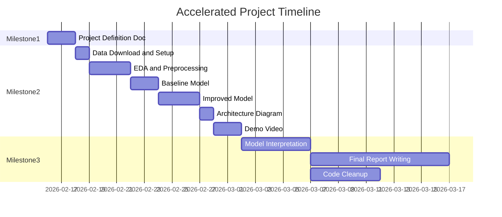

# Accelerated Customer Churn Prediction Project

Given that 6 weeks have passed with no submission, we need an aggressive but achievable plan.

---

## Project Overview

| Dimension | Choice |

|-----------|--------|

| **Problem Type** | Binary Classification (Will customer churn? Yes/No) |

| **Data Type** | Tabular |

| **Technique Category** | Machine Learning |

| **System Context** | Prediction Pipeline + Interpretation Dashboard |

**Dataset:** Telco Customer Churn (Kaggle) - 7,043 customers, 21 features, clean data

---

## Accelerated Timeline

---

## Phase 1: Milestone 1 - Project Definition (DO THIS NOW)

**Time:** Today - Submit ASAP

I will help you create the 3-page document with:

1. Problem Statement (why churn prediction matters)
2. Data Source (Telco dataset from Kaggle)
3. Intended Methods (Logistic Regression baseline, XGBoost/Random Forest improved)
4. Expected Outputs (trained model, evaluation metrics, interpretation, simple dashboard)
5. Key Risks (class imbalance, overfitting, feature quality)

---

## Phase 2: Milestone 2 - Technical Checkpoint (Next 2 weeks)

**Deliverables:**

1. Data preprocessing completed
2. Exploratory Data Analysis (visualizations)
3. Baseline + improved model implemented
4. System architecture diagram
5. Code link (GitHub)
6. Demo video (max 6 minutes)

**Technical Work Breakdown:**

| Day | Task | Output |

|-----|------|--------|

| 1 | Download data, set up project structure | `data/`, `notebooks/`, `src/` folders |

| 2-3 | EDA notebook | Charts showing churn patterns, correlations |

| 4 | Data preprocessing | Clean dataset, encoded features |

| 5-6 | Baseline model (Logistic Regression) | Model + evaluation metrics |

| 7-8 | Improved model (XGBoost) | Better model + comparison |

| 9 | Architecture diagram | Visual of pipeline |

| 10 | Record demo video | 6-min walkthrough |

---

## Phase 3: Milestone 3 - Final Submission (Weeks 9-12)

**Deliverables:**

1. Final report (25-30 pages)
2. Model interpretation (SHAP values)
3. Code repository
4. Reproducibility checklist

---

## Immediate Next Steps

1. **Create project folder structure**
2. **Download the dataset**
3. **Write Milestone 1 document together**
4. **Start EDA immediately after submission**

---

## What I Will Teach You Step-by-Step

For each phase, I will explain:

- **What** we are doing
- **Why** it matters (for grades and real-world skills)
- **How** to implement it (with code examples)
- **How to explain it** in viva

Ready to start? I recommend we begin with the Milestone 1 document right now.