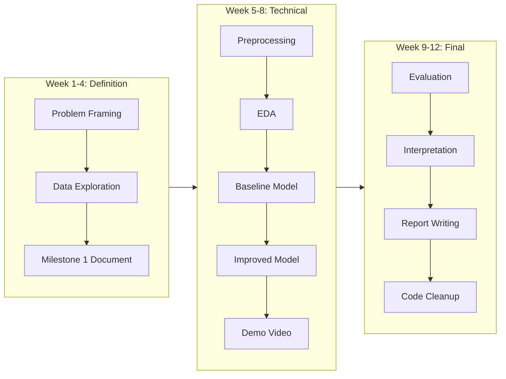

# Recommended Capstone Projects for CS5998

Based on your beginner level and the [Capstone student guide](docs/course/Capstone_Student_Guide.md) requirements, here are **3 projects** ranked by ease of execution while maximizing your learning and grade potential.

---

## Recommendation 1: Customer Churn Prediction System (EASIEST - Highly Recommended)

### Why This Project?

- **Most beginner-friendly** with abundant tutorials
- Clear business relevance (companies lose millions to churn)
- Structured pipeline that's easy to follow and explain in viva
- Teaches core ML skills you'll use throughout your career

### Project Scope Definition

| Dimension | Your Choice |

|-----------|-------------|

| Problem Type | Binary Classification |

| Data Type | Tabular |

| Technique Category | Machine Learning |

| System Context | Prediction Pipeline with Interpretation Dashboard |

### Dataset (Freely Available)

**Telco Customer Churn** - Kaggle

- URL: https://www.kaggle.com/datasets/blastchar/telco-customer-churn
- Size: 7,043 customers, 21 features
- Quality: Clean, well-documented, no missing value issues
- Features: Demographics, services subscribed, tenure, billing info

### What You'll Build and Learn

1. **Data preprocessing** - handling categorical variables, encoding
2. **Exploratory Data Analysis** - visualizing churn patterns
3. **Baseline model** - Logistic Regression
4. **Improved model** - Random Forest or XGBoost
5. **Model interpretation** - Feature importance, SHAP values
6. **Simple dashboard** - Streamlit app showing predictions

### Why You'll Score Well

- Directly maps to rubric criteria
- Easy to justify every decision
- Clear metrics: Accuracy, Precision, Recall, F1, AUC-ROC
- Strong viva defense - intuitive problem everyone understands

---

## Recommendation 2: Credit Card Fraud Detection System (MODERATE)

### Why This Project?

- Extremely relevant real-world problem
- Teaches important concept: **class imbalance handling**
- Impressive to explain (anomaly detection)
- Large dataset shows you can handle scale

### Project Scope Definition

| Dimension | Your Choice |

|-----------|-------------|

| Problem Type | Anomaly Detection / Binary Classification |

| Data Type | Tabular |

| Technique Category | Machine Learning |

| System Context | Detection Pipeline with Alert System |

### Dataset (Freely Available)

**Credit Card Fraud Detection** - Kaggle

- URL: https://www.kaggle.com/datasets/mlg-ulb/creditcardfraud
- Size: 284,807 transactions, 31 features
- Quality: Pre-processed (PCA applied for privacy), well-structured
- Challenge: Only 0.17% are frauds (class imbalance)

### What You'll Build and Learn

1. **Handling imbalanced data** - SMOTE, undersampling
2. **Feature engineering** - transaction patterns
3. **Baseline** - Logistic Regression
4. **Advanced** - Isolation Forest, XGBoost
5. **Evaluation** - Precision-Recall curves, confusion matrix
6. **Threshold tuning** - business cost optimization

### Why You'll Score Well

- Demonstrates understanding of real-world challenges
- Shows depth (class imbalance is a sophisticated topic)
- Clear evaluation with business interpretation
- Memorable project for viva

---

## Recommendation 3: Student Performance Prediction System (EASIEST ALTERNATIVE)

### Why This Project?

- Personally relatable (you're a student!)
- Very clean, small dataset - quick iterations
- Clear educational impact story
- Easy to explain and defend

### Project Scope Definition

| Dimension | Your Choice |

|-----------|-------------|

| Problem Type | Classification / Regression |

| Data Type | Tabular |

| Technique Category | Machine Learning |

| System Context | Early Warning System Pipeline |

### Dataset (Freely Available)

**Student Performance Dataset** - UCI ML Repository

- URL: https://archive.ics.uci.edu/ml/datasets/Student+Performance
- Size: 649 students, 33 features
- Quality: Well-documented, real data from Portuguese schools
- Features: Demographics, family, study habits, grades

### What You'll Build and Learn

1. **EDA** - What factors affect student success?
2. **Feature engineering** - Creating meaningful predictors
3. **Baseline** - Simple regression/classification
4. **Improved model** - Ensemble methods
5. **Interpretation** - Which factors matter most?
6. **Early warning system** - Identify at-risk students

### Why You'll Score Well

- Highly interpretable results
- Social impact angle (education improvement)
- Small dataset = fast experimentation = more time for depth
- Easy viva defense - you understand the domain

---

## My Recommendation

**Start with Project 1 (Customer Churn Prediction)** because:

1. Perfect difficulty level for beginners
2. Most tutorials and resources available
3. Clearest path from start to finish
4. Balances technical depth with simplicity
5. Easy to extend if you want to go deeper

---

## How I'll Guide You Step-by-Step

If you choose a project, I'll help you through each phase:

Each step will be broken down into small, manageable tasks with explanations of **what** we're doing and **why** - so you truly learn and can defend your work confidently.

---

## Next Steps

1. **Pick your project** from the 3 options above
2. I'll help you write the **Milestone 1: Project Definition Document**
3. We'll begin the technical work with detailed guidance

Which project interests you most?