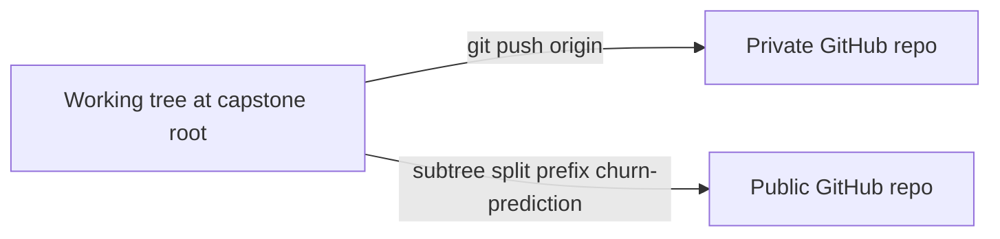

# Two repos: private (full workspace) vs public (`churn-prediction/` only)

## Constraint

If you run `git init` in both the workspace root **and** [`churn-prediction/`](c:\Users\Admin\Documents\Postgraduate\MDSAI\CS5998 - Capstone Project\churn-prediction), the parent repo will **not** reliably track the same files as normal paths (nested `.git`). Pick **one** of the workflows below.

---

## Recommended: one repo at root + subtree push to public (simplest single working copy)

You keep a **single** `.git` at [`CS5998 - Capstone Project`](c:\Users\Admin\Documents\Postgraduate\MDSAI\CS5998 - Capstone Project). Everything (including [`.cursor/`](c:\Users\Admin\Documents\Postgraduate\MDSAI\CS5998 - Capstone Project\.cursor), [`docs/`](c:\Users\Admin\Documents\Postgraduate\MDSAI\CS5998 - Capstone Project\docs), guides, submissions) is committed here and pushed to a **private** remote. Only the `churn-prediction/` prefix is pushed to the **public** remote when you choose.



**Setup (high level)**

1. On GitHub: create **Repo A** (private) and **Repo B** (public), both empty, no README (or accept you will merge).
2. In the workspace root:
   - `git init`
   - `git add .` and first commit (respect existing [`.gitignore`](c:\Users\Admin\Documents\Postgraduate\MDSAI\CS5998 - Capstone Project\.gitignore)).
   - `git remote add origin <Repo_A_private_URL>`
   - `git push -u origin main` (or `master`).
3. Add second remote: `git remote add public <Repo_B_public_URL>`.
4. **First publish** of grading repo (from root):

   

```bash
   git subtree split --prefix=churn-prediction -b churn-public
   git push public churn-public:main --force
   

```

   After that, routine updates can use `git subtree push --prefix=churn-prediction public main` (occasionally slow on large history; the split branch pattern above remains the reliable fallback).

**Why this fits “clean for grading”**

- Repo B’s root **is** the project: `README.md`, `requirements.txt`, `data/`, `notebooks/`, etc.—no extra `churn-prediction/` folder layer.
- `.cursor/`, personal `docs/`, and other workspace-only material **never** appear in the public history because they are outside the prefix.

**Optional hardening**

- Add a dedicated [`.gitignore` inside `churn-prediction/`](c:\Users\Admin\Documents\Postgraduate\MDSAI\CS5998 - Capstone Project\churn-prediction) for anything markers should not see or that is too large (e.g. `models/*.pkl`, local secrets)—keep the public tree reproducible and small.
- If the Kaggle CSV is large, confirm course rules on committing data; otherwise document download steps in the public README.

---

## Alternative: submodule (two repos, explicit link)

1. Initialize **public** repo **only** inside `churn-prediction/`: `git init`, commit, `git remote add origin <Repo_B>`, push. Repo B contains the grading project at its root.
2. At workspace root: `git init`, add all **non–churn-prediction** paths, then run `git submodule add <Repo_B_URL> churn-prediction` **only if** you can replace the folder with a submodule clone (typical clean path: backup `churn-prediction`, clone submodule into that name, copy any uncommitted work back, commit in submodule, push submodule, then commit parent).

**Tradeoffs**

- Markers clone Repo B only—still clean.
- Private repo stores a **commit pointer** for `churn-prediction`; you must commit in the submodule and push Repo B, then update the parent and push Repo A—two-step workflow.

---

## What not to do

- Do not rely on two nested `.git` directories in the same tree without submodule wiring—you risk a confusing or broken parent history.
- Do not put API keys or `.env` in either repo; keep them gitignored ([root `.gitignore`](c:\Users\Admin\Documents\Postgraduate\MDSAI\CS5998 - Capstone Project\.gitignore) already mentions `.env`).

---

## Summary

| Goal | Approach |
|------|-----------|
| One working folder, private has everything, public is grading-only | **Root repo + `git subtree split` / `subtree push`** to public remote |
| You want two clearly separate Git histories from day one | **Submodule** (public = `churn-prediction` only; private = rest + submodule) |

Default recommendation: **subtree workflow** for your layout and “clean public root” requirement.
